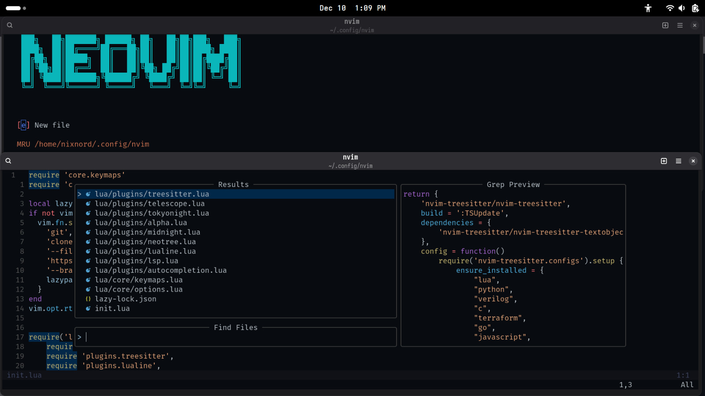
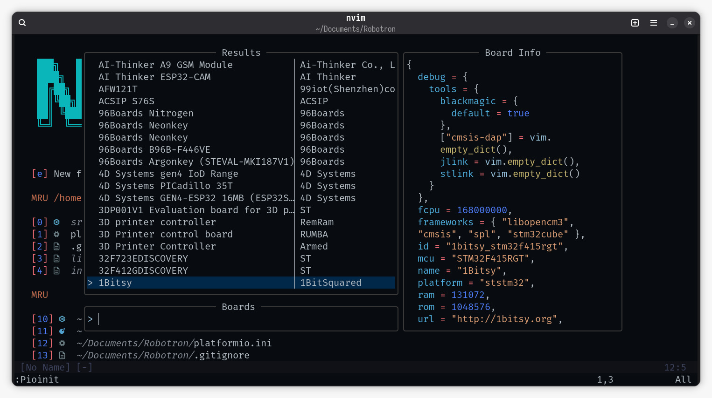

##Config files for Neovim

These config files are based on `kickstart.nvim`. To set up clone the repository and copy the folder to your `~/.config/` folder and rename it to `nvim`
I will keep improving it with time.

